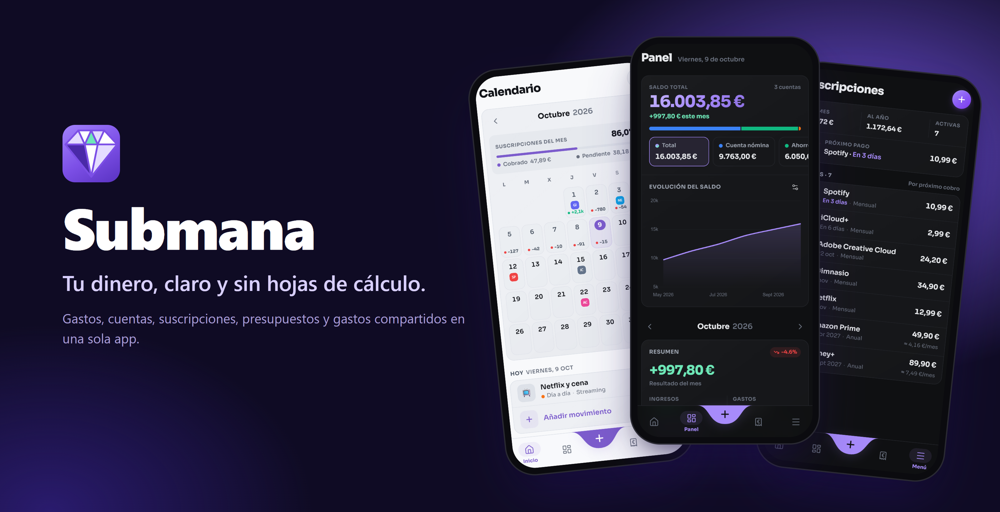
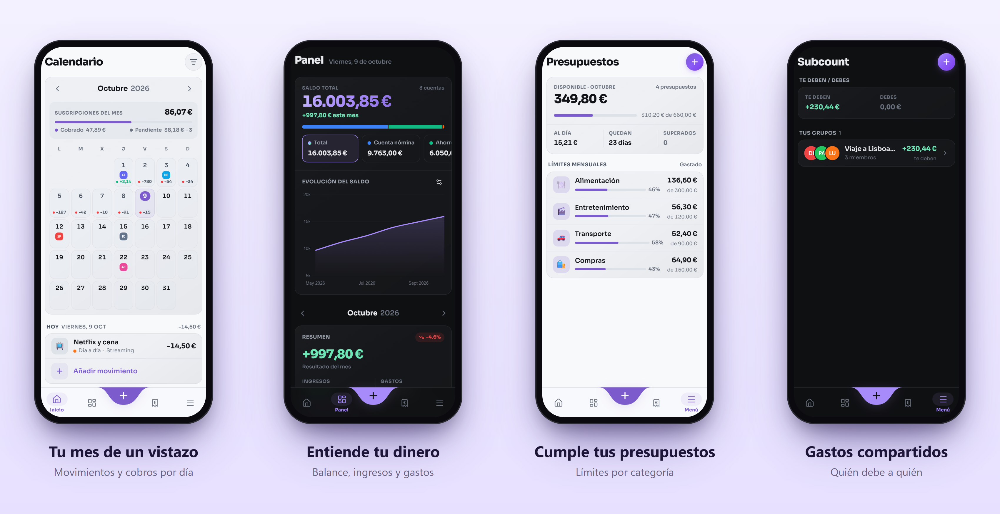

  
  

    <a href="https://submana.vercel.app"><strong>Abrir Submana →</strong></a>
  

  

    
    
    
  

---

## Por qué Submana

Llevar las finanzas en una hoja de cálculo funciona… hasta que dejas de actualizarla. Submana ocupa su lugar: **subes el extracto del banco, él hace el resto** y te enseña de un vistazo en qué se va el dinero, qué se cobra este mes y si vas a llegar a fin de mes.

Es un producto de uso personal, pensado y pulido para el día a día.

## Qué puedes hacer

### 📅 Ver tu mes de un vistazo
Un calendario con las transacciones de cada día y los próximos cobros de tus suscripciones. Filtra por cuenta y entiende cómo se reparte el mes sin abrir ninguna tabla.

### 📊 Entender a dónde va tu dinero
Un dashboard con la evolución de tu balance, ingresos frente a gastos mes a mes, gasto diario, categorías y movimientos que más pesan. Incluye **previsión de gasto a fin de mes** y **proyección de ahorro anual**.

### 🏦 Importar tus extractos en segundos
Sube el archivo de tu banco y Submana crea los movimientos, ajusta el saldo y te pregunta solo cuando algo parece duplicado. Si vuelves a subir el mismo extracto, no se repite nada.

| Banco | Formato |
|---|---|
| Trade Republic | PDF |
| Revolut | Excel / CSV |
| BBVA | Excel |
| Imagin | CSV |

Las transferencias entre tus propias cuentas se reconocen solas para que no inflen tus ingresos ni tus gastos.

### 🔁 Controlar tus suscripciones
Todos tus pagos recurrentes —diarios, semanales, mensuales, anuales o cada *N* periodos— con su coste mensual y anual total y la fecha del próximo cobro en el calendario. Elige con cuánta antelación quieres que te avise de cada renovación. Sin sorpresas.

### 🎯 Cumplir tus presupuestos
Pon un límite mensual por categoría, mira tu progreso y recibe un aviso al llegar al 80 % y al 100 %. Crea tus propias categorías y subcategorías con emoji.

### 👥 Compartir gastos con amigos
Añade amigos, crea grupos, reparte un gasto como quieras y consulta quién debe a quién. Salda cuentas con un toque. También hay **cuentas conjuntas** para llevar el dinero en común.

### 🔔 Enterarte de lo que importa
Submana te avisa de lo que pasa sin que tú hagas nada: una suscripción que se renueva o está a punto de terminar, un gasto nuevo en un grupo, una solicitud de amistad, un movimiento en una cuenta conjunta o el **resumen del mes** con lo que gastaste e ingresaste.

- **Bandeja de notificaciones** agrupada por día, con filtro de no leídas. Acepta o rechaza invitaciones desde la propia notificación.
- **Notificaciones push** en el móvil y el escritorio, también con la app cerrada. Puedes ocultar los importes en ellas.
- **Tú decides qué te llega**: activa o desactiva cada tipo, elige el día del resumen mensual y silencia un grupo o una cuenta conjunta concretos.

### ✨ Y los detalles que se agradecen
- **Modo privacidad** para ocultar los importes cuando alguien mira la pantalla.
- **Sincronización en tiempo real** entre dispositivos.
- **Tema claro y oscuro**, en **español e inglés**.
- **Deshacer** en lugar de confirmar cada borrado.
- Atajos de teclado, gestos de deslizar y reordenación con arrastrar y soltar.

## Instalación como app

Submana es una PWA: ábrela en el navegador y elige **«Instalar»** (escritorio y Android) o **«Añadir a pantalla de inicio»** (iOS). Se comporta como una app nativa, recibe notificaciones push y muestra una pantalla propia si te quedas sin conexión. En iPhone y iPad, las push solo funcionan con Submana instalada en la pantalla de inicio; actívalas desde tu perfil.

## Hecho con

Next.js · React · TypeScript · Tailwind CSS · Supabase · Vercel

---

  Hecho por <a href="https://github.com/Diego-Mardomingo">Diego Mardomingo</a>

